# LeFeel


## Étude des Mécanorécépteurs du Derme
### La Strucutre du Derme

La peau est constituée de différents mécanorécepteurs qui réagissent plus ou moins rapidement avec un facteur d’adaptabilité.


On retrouve dans la structure du derme plusieurs types de mécanorécepteurs :

* Les Corpuscules de Pacini
* Les Corpuscules de Rufini
* Les Corpuscules de Meissner
* Les Disques de Merkel

*Notre étude s'est orientée vers les corpuscules de Pacini présents dans les différents types de peau même s'ils sont sensibles à des stimulations plus importantes que d'autres récepteurs.*

### Les Corpuscules de Pacini

Les corpuscules de Pacini sont formés par de nombreuses lamelles concentriques. Au centre, se trouve une fibre sensitive. Ces cellules sont principalement des récepteurs de vibration de haute fréquence (pression intermittente). Les corpuscules sont des récepteurs phasiques, car leur adaptation est très rapide.


Lors de pressions sur le corpuscule, l'énergie mécanique déforme la membrane neuronale de la fibre, ce qui a la propriété d'ouvrir les canaux ioniques et de provoquer l'apparition d'un potentiel récepteur.

* Si l'intensité du stimulus est suffisante, ce potentiel récepteur se transforme en potentiel d'action dans la fibre.
* Si la pression est continue, la fréquence des potentiels diminue.

L'adaptation très rapide de cette cellule demande une sollicitation répétée pour assurer une perception de toucher optimale et convainquante.


(fr) [Corpuscule de Pacini](https://fr.wikipedia.org/wiki/Corpuscule_de_Pacini)


## Étude sur la perception du touché

Benchmark des technologies qui permettent de sentir :

* marque n°1
* marque n°2
* marque n°3

### Optimisation de la taille de la cellule Haptique

Nous nous sommes inspirés des recherches de [Vincent Hayward](http://www.isir.upmc.fr/?op=view_profil&id=19), chercheur à l'ISIR spécialisé dans la conception d'intefaces Haptiques. Sa recherche nous apporte la connaissance de la taille idéale de notre cellule pour que l'utilisateur perçoive le toucher.


[Spatio-temporal skin strain distributions evoke low variability spike responses in cuneate neurons](https://www.ncbi.nlm.nih.gov/pubmed/24451390)

Avec les recherches de Vincent Hayward, nous optons donc pour une cellule de 8 mm de diamètre. Optimal pour la perception du toucher.

Nous avons fait faire des aimants en Néodyme très puissants mais qui ont la particularité d'être extrêmement fins. la taille de l'aimant est de 8 mm de diamètre avec une épaisseur de 0,8 mm.


## Étude sur les bobinages
### Introduction sur l'utilisation des bobinages

Les bobinages sont un enroulement d'un fil conducteur créant un champ magnétique.

(fr) [Bobine élèctricité](https://fr.wikipedia.org/wiki/Bobine_(électricité)]

### Loi de LENZ

Le phénomène d'induction électromagnétique s'oppose à la cause qui lui a donné naissance.
Cette propriété électrique permet de nous indiquer comment alimenter les bobines et dans quel sens le courant doit circuler.


(fr) [Loi de LENZ-FARADAY](https://fr.wikipedia.org/wiki/Loi_de_Lenz-Faraday)

Cette loi nous permet de faire les premières simulations pour reproduire la sensation de toucher.


Avec cette même loi, simulation avec 9 cellules.


Après simulation on remarque plusieurs choses :

* Il serait intéressant de tenter de produire les bobines à plat même si le champ magnétique n'est pas idéal
* Une optimisation de la forme des bobines est possible pour améliorer le rendement de l'inductance

### Étude de bobine en plan pour la gravure

Pour optimiser la fabrication du bobinage du produit, l'idéal serait de pouvoir produire les bobines en plan grace à un procédé simple de gravure de PCB sur [Pyralux](http://www.dupont.com/content/dam/dupont/products-and-services/electronic-and-electrical-materials/flexible-rigid-flex-circuit-materials/documents/PyraluxAPclad_DataSheet.pdf), un matériau souple utilisé pour fabriquer des PCBs.

Si le bobinage en plan s'avère…

##### Génération de bobine en plan

Pour optimiser le rendement, les bobines doivent être générées grâce a des algorithmes strictes qui respectent l'espacement entre les conducteurs, espacement minimal dû à la gravure [en mm ?],

```
beginShape();
	curveVertex(x + spiralCenter.x, y + spiralCenter.y);
	while (currentRadian < endRadian)
	{
		currentRadian += deltaAngle;
		currRadius = map(currentRadian, startRadian, endRadian, startRadius, endRadius);
		x = cos(currentRadian) * currRadius;
		y = sin(currentRadian) * currRadius;
		curveVertex(x + spiralCenter.x, y + spiralCenter.y);
	}  
endShape();
```

##### Optimiation de la forme de la bobine en plan

Pour une utilisation optimale de la surface du Pyralux, le cercle ne paraît pas être adapté. Cette forme créé des vides entre chaque forme. Un polygone devrait pouvoir optimiser l'espace et assurer une répartition totale des bobines.


### Conception LeFeel

##### Simulation du textile

Nos recherches nous permettent de créer la première simulation complète de notre textile sensible.


La simulation de tous les éléments du textile permet d'en apercevoir la taille.


##### Simulation du microcontroleur

La définition de l'arbre d'interactivité nous permet de définir les composants principaux de la carte électronique.


Les contraintes du microcontrôleur sont principalement sa taille, son autonomie et sa configuration automatique.

Notre contrainte principale sera la facilité de configuration de l'objet par l'utilisateur. Son utilisation sera évidente et ne nécéssitera pas de configuration. pas besoin d'entrer le mot de passe du réseau local ni d'effectuer une initialisation du contrôleur.

Pour se faire 3 technologies s'ouvrent à nous :

* Sigfox
	* + Acteur Francais
	* + Technologie pes chère et scalable
	* - Vitesse de transmission des données très limitées quelques bits par heure

* Lora (technologie développée par Orange)
	* + Acteur Français
	* - Technologie encore nouvelle et peut répandue
	* - Limitation du nombre de bits à envoyer

* LTE
	* + Standard international
	* + Très grand débit de données
	* + Très scalables
	* - Technologie assez chère

Nous avons choisi la technologie LTE qui est la plus courante et nous permet une grande quantité de données en transit.
Cette technologie possède une couverture mondiale bien meilleure que celle de l'internet traditionnel.

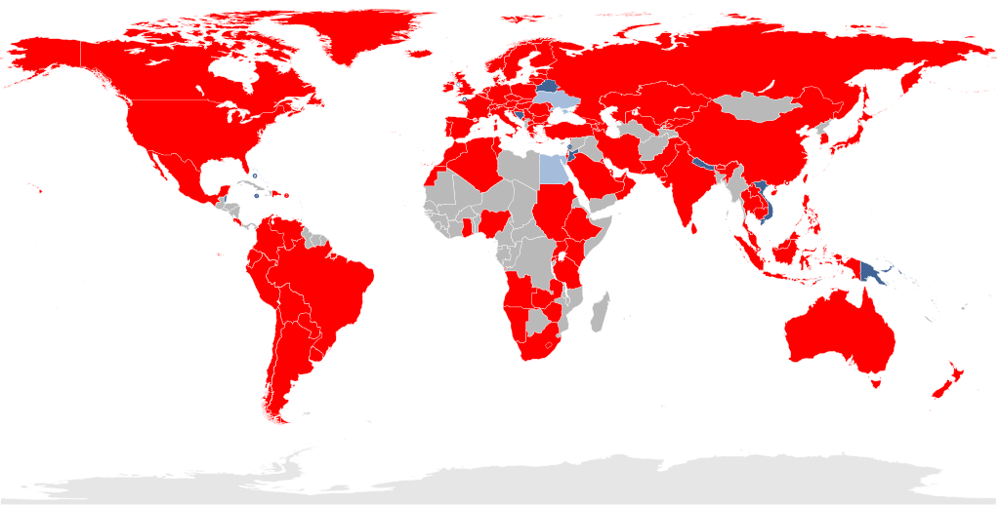

Pour récapituler notre hardware a besoin :

* Une chip LTE
* Gestion de l'alimentation
* Multiplexage
* Bouton RESET
* LED de statut

Simulation du microcontrôleur

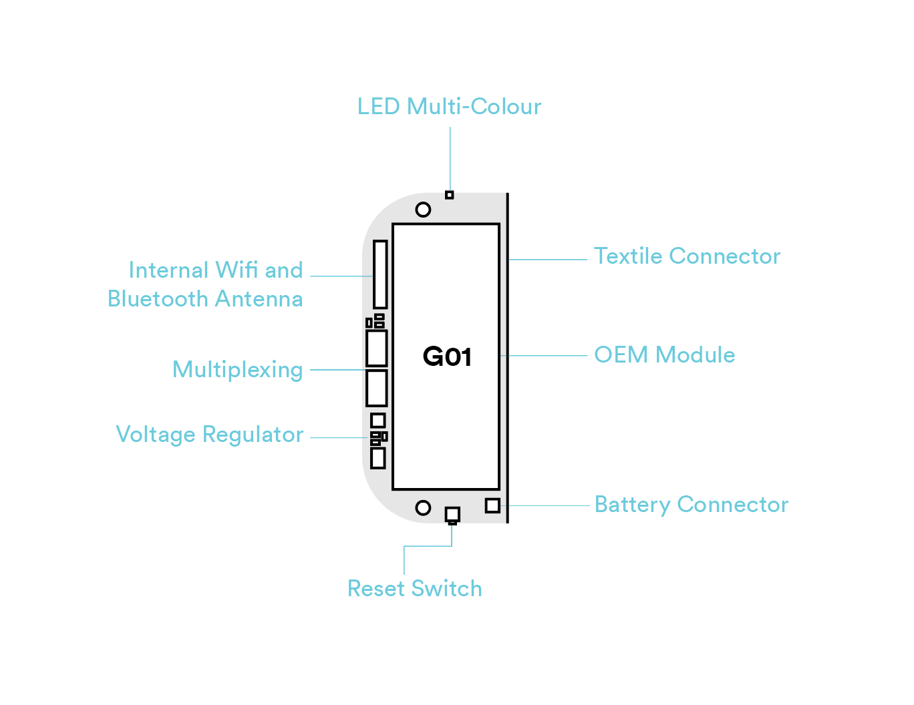

Après recherche, nous avons trouvé un microcontrôleur qui répond à toutes nos attentes : le G01 EOM Module fabriqué par [Pycom](https://www.pycom.io). [lien faire ses caractéristique >](img/g01Specsheet.pdf)

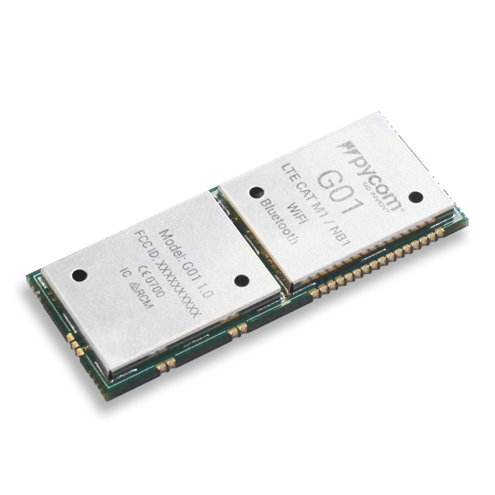

Simulation de la taille du contrôleur

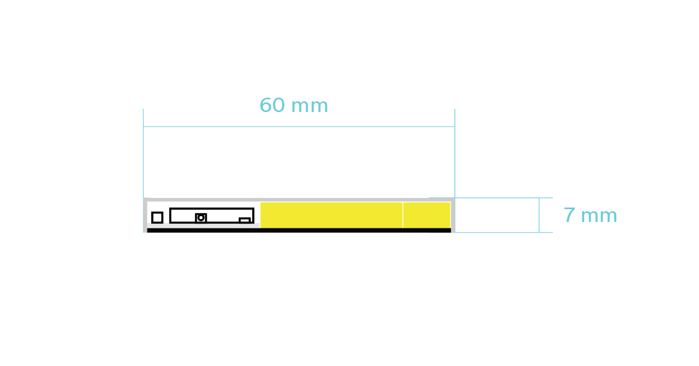
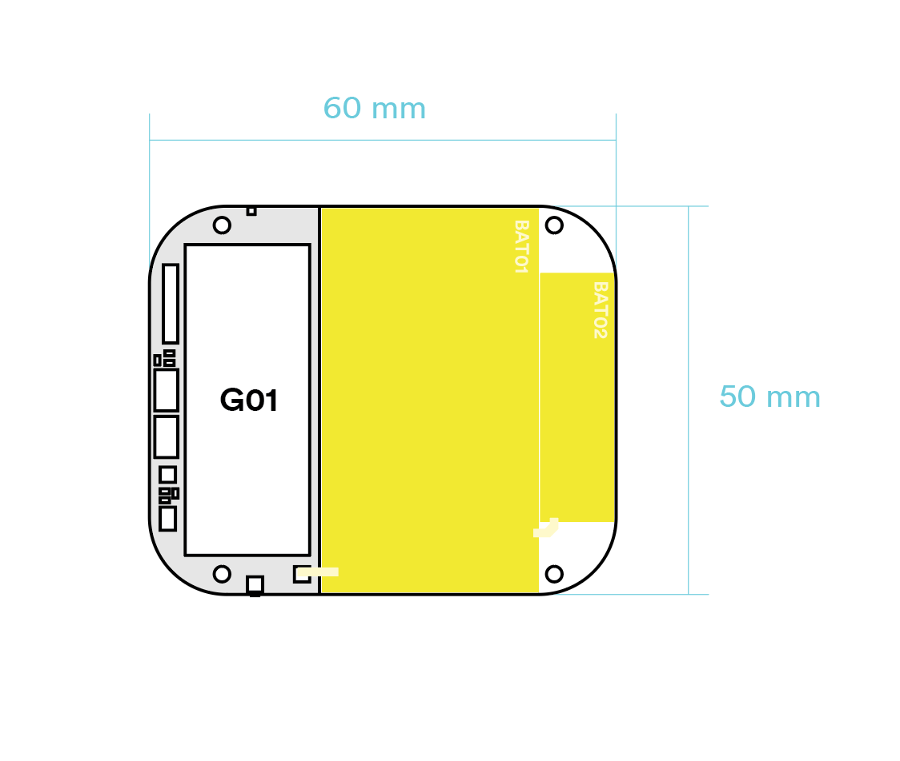

Simulation en 3D

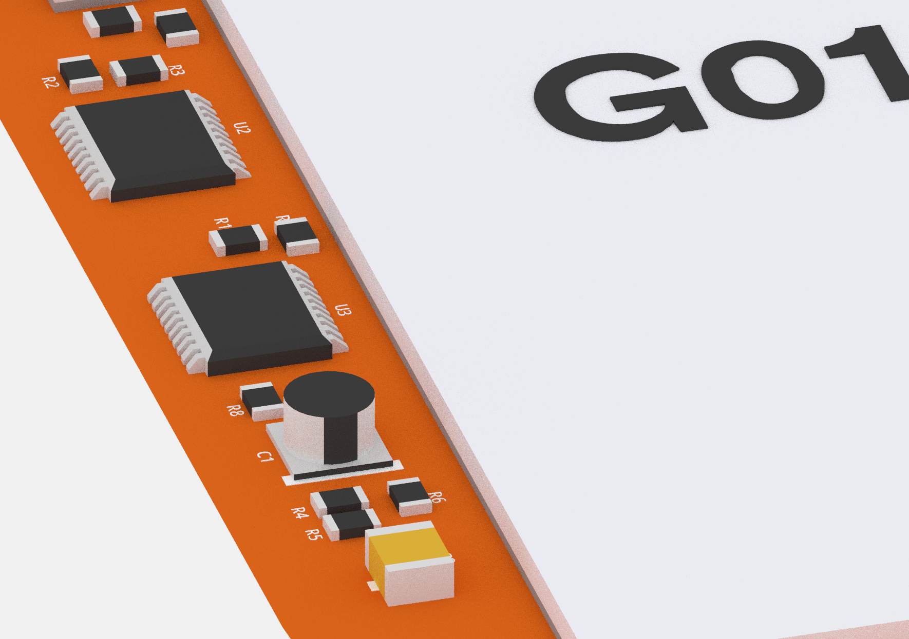
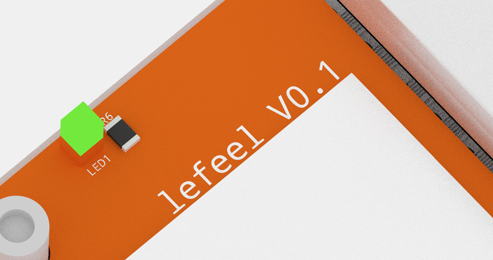
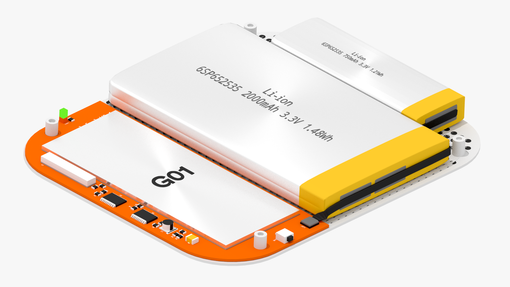

Connexion entre le microcontrôleur et le textile par billage

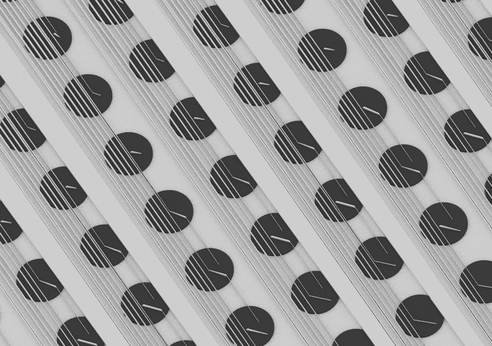
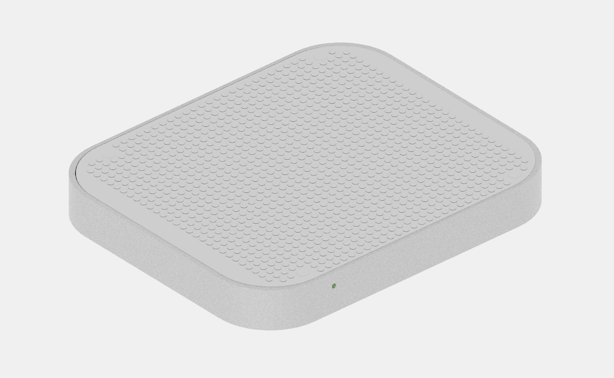

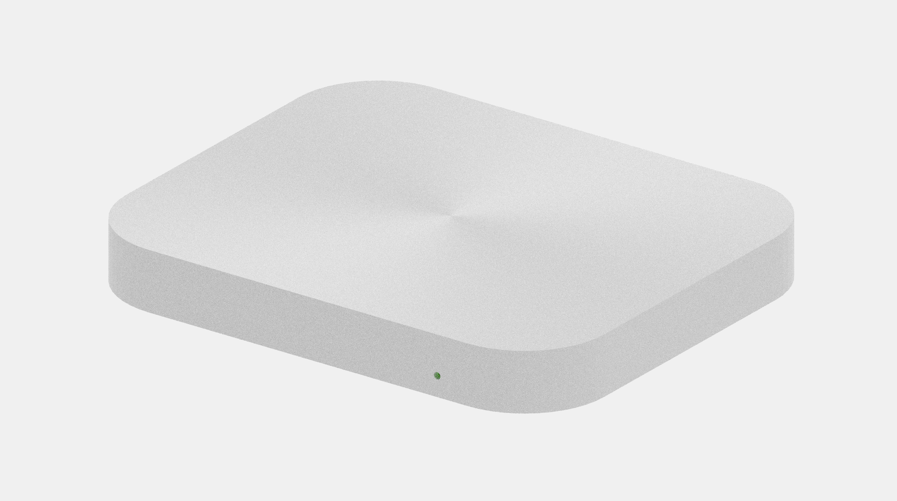

### transmission du toucher en information

##### Prototypage

Pour réaliser une surface plusieur technique sont possible. mais deux sont principalement utilisé Capacitive ou Resistive.

Nous avons choisi une la solution Capacitive

Une solution est d'utiliser un textile dit zébre comme surface de détection du toucher.

Hitek vend un "[Fabric Evaluation Kit](https://www.hitek-ltd.co.uk/fabric-evaluation-kit)" tout fait pour 20£ 
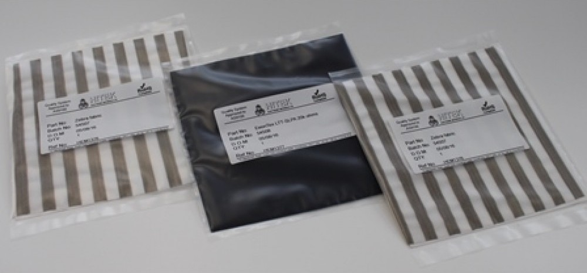

Grâce à des capteurs capacitif les bandes du tissus peuvent facilement être relié à un arduino.

Nous avons opté pour le capteur []

[IMG]

###### Description d'une caresse en information


###### Optimisation de la transmition du toucher

Une approche vectorielle de la transmission du toucher pourrait nous permettre d'économiser de la transmission d'informations et donc de la batterie. À calculer si cette économie de Bits ne se perd pas quand l'algorithme calcule la vectorisation en coordonnées.


Les recherches de Vincent Hayward sont une ouverture pour optimiser le déclenchement des bobines.


### Comment nos utilisateurs touchent le feel ?

Inspiration de la structure de la peau pour adapter le textile à nos utilisateurs

###### Lefeel sous les doights

typologie de geste affecitf

Caractéristique choisie : Vitesse, Pression, Localisation.

1 -
2 -
3 -
4 -
5 -

###### Adapter lefeel au usagé

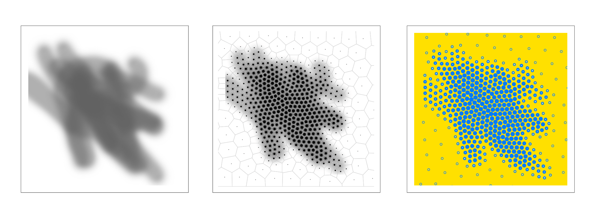

En mathématiques, un diagramme de Voronoï est un découpage du plan (pavage) en cellules à partir d'un ensemble discret de points

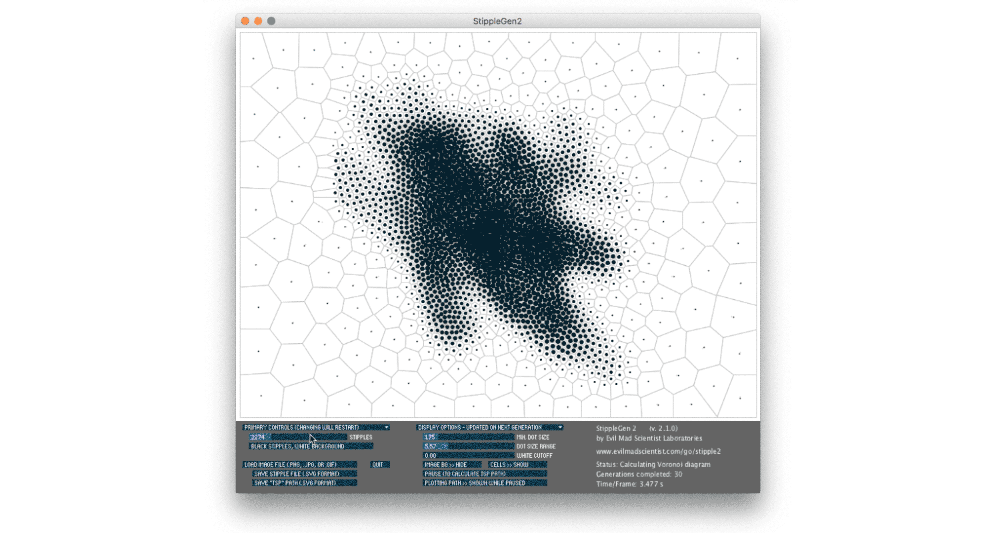
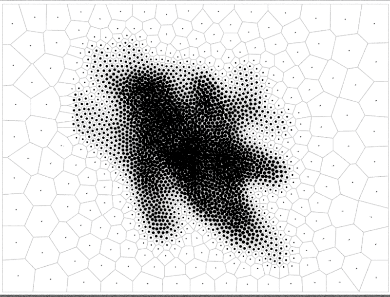

Après accumulation des différentes typologie de toucher affectif voilà l
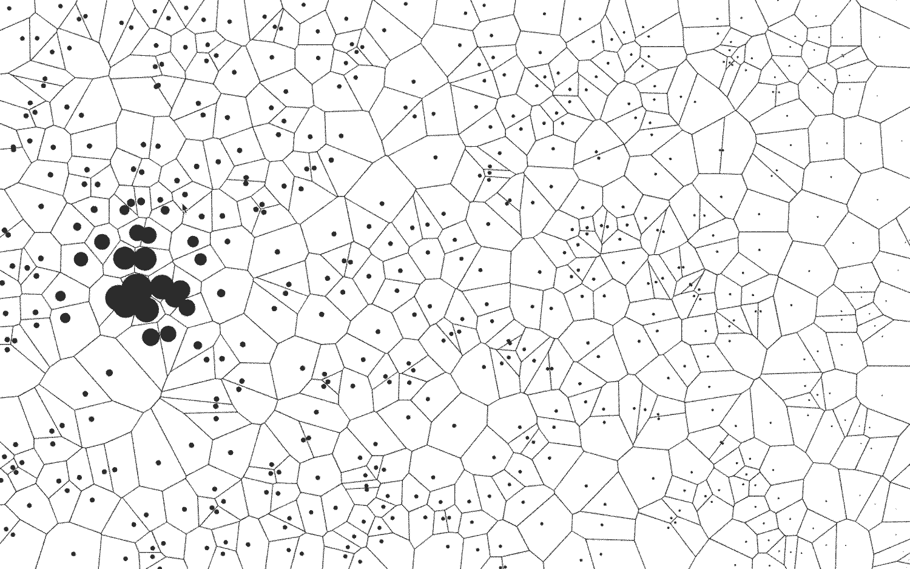

### Étude sur la recherche d'Alimentation par Induction

[Quasistatic Cavity Resonance for Ubiquitous Wireless Power Transfer](https://www.youtube.com/watch?v=pkMbZmwhpDc)
