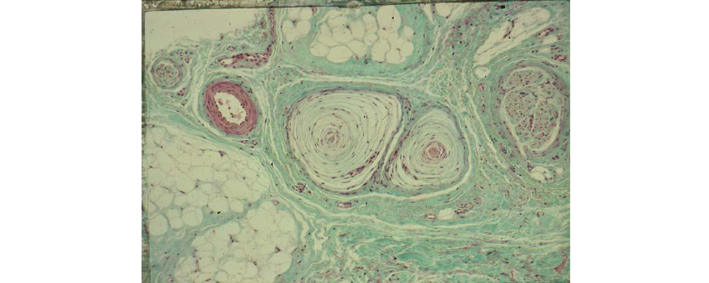

# LeFeel


## Étude des Mécanorécépteurs du Derme
### La Strucutre du Derme

La peau est constituée de différents mécanorécepteurs qui réagissent plus ou moins rapidement avec un facteur d’adaptabilité.


On retrouve dans la structure du derme plusieurs types de mécanorécepteurs :

* Les Corpuscules de Pacini
* Les Corpuscules de Rufini
* Les Corpuscules de Meissner
* Les Disques de Merkel

*Notre étude s'est orientée vers les corpuscules de Pacini présent dans les différents types de peau même s'ils sont sensibles à des stimulations plus importantes que d'autres récepteur.*

### Les Corpuscules de Pacini

Les corpuscules de Pacini sont formés par de nombreuses lamelles concentriques. Au centre, se trouve une fibre sensitive. Ces cellules sont principalement des récepteurs de vibration de haute fréquence (pression intermittente). Les corpuscules sont des récepteurs phasiques, car leur adaptation est très rapide.



Lors de pressions sur le corpuscule, l'énergie mécanique déforme la membrane neuronale de la fibre, ce qui a la propriété d'ouvrir les canaux ioniques et de provoquer l'apparition d'un potentiel récepteur.

* Si l'intensité du stimulus est suffisante, ce potentiel récepteur se transforme en potentiel d'action dans la fibre.
* Si la pression est continue, la fréquence des potentiels diminue.

L'adaptation très rapide de cette cellule demande une sollicitation répétée pour assurer une perception de toucher optimale et convaincante.


(fr) [Corpuscule de Pacini](https://fr.wikipedia.org/wiki/Corpuscule_de_Pacini)


## Étude sur la perception du touché

Benchmark des technologie qui permettent de sentir :

* marque n°1
* marque n°2
* marque n°3

### Optimisation de la taille de la cellule Haptique

Nous nous somme inspiré des recherches de [Vincent Hayward](http://www.isir.upmc.fr/?op=view_profil&id=19), Chercheur à l'ISIR il est spécialisé dans la conception d'inteface Haptique. Sa recherche nous apporte la connaicance de la taille idéale de notre cellule pour que l'utilisateur perçoive le toucher.


[Spatio-temporal skin strain distributions evoke low variability spike responses in cuneate neurons](https://www.ncbi.nlm.nih.gov/pubmed/24451390)

Avec les recherches de Vincent Hayward nous optons donc pour une cellule de 8 mm de diamètre. Optimal pour la perception du toucher.

Nous avons fais faire des aimants en Néodyme très puissant mais qui ont la particularité d'être extrêment fin. la taille de l'aimant est de 8 mm de diamètre avec une épaisseur de 0,8 mm.


## Étude sur les bobinages
### Introduction sur l'utilisation des bobinages

Les bobinages sont un enroulement d'un fil conducteur créant un champ magnétique

(fr) [Bobine élèctricité](https://fr.wikipedia.org/wiki/Bobine_(électricité))

### Loi de LENZ

Le phénomène d'induction électromagnétique s'oppose à la cause qui lui a donné naissance.
Cette propriété électrique permet de nous indiquer comment alimenter les bobine et dans quel sens le courant doit circuler


(fr) [Loi de LENZ-FARADAY](https://fr.wikipedia.org/wiki/Loi_de_Lenz-Faraday)

Cette loi nous permet de faire les premières simulation pour reproduire la sensation de toucher.


Avec cette même loi, simulation avec 9 cellules.


Après simulation on remarque plusieurs choses :

* Il serait interressant de tenter de produire les bobines à plat même si le champ magnétique n'est pas idéal
* Une optimisation de la forme des bobines est possible pour améliorer le rendement de l'inductance

### Étude de bobine en plan pour la gravure

Pour optimiser la fabrication du bobinage du produit l'idéal serait de pouvoir produire les bobine en plan grace a un procédé simple de gravure de PCB sur [Pyralux](http://www.dupont.com/content/dam/dupont/products-and-services/electronic-and-electrical-materials/flexible-rigid-flex-circuit-materials/documents/PyraluxAPclad_DataSheet.pdf), un matériaux souple utilisé pour fabriquer des PCB.

Si le bobinage en plan s'avere

##### Génération de bobine en plan

Pour optimiser le rendement les bobines doivent être généré grace a des algorithmes strique qui respece l'espacement entre les conducteurs, espacement minimal dû a la gravure [en mm ?],

```
beginShape();
	curveVertex(x + spiralCenter.x, y + spiralCenter.y);
	while (currentRadian < endRadian)
	{
		currentRadian += deltaAngle;
		currRadius = map(currentRadian, startRadian, endRadian, startRadius, endRadius);
		x = cos(currentRadian) * currRadius;
		y = sin(currentRadian) * currRadius;
		curveVertex(x + spiralCenter.x, y + spiralCenter.y);
	}  
endShape();
```

##### Optimiation de la forme de la bobine en plan

Pour une utilisation optimale de la surface du Pyralux le cercle ne parait être adapté il fait naitre des ajouration entre chaque forme. un polygone devrait pouvoir optimiser l'espace et assurer une repartition total des bobines.


### Conception LeFeel

##### Simulation du textile

Nos recherches nous permettent de créer la prermière simulation complète de notre textile sensible


La simulation de tout les élèments du textile permettent d'en apercevoir la taille


##### Simulation du microcontroleur

La définition de l'arbre d'interractivité nous permet de définir les composants principaux de la carte élèctronique


Les contraites du microcontroleur sont principalement sa taille et son autonomie et sa configuration automatique.

Notre contraite principale sera la facilité de configuration de l'objet par l'utilisateur. Son utilisation sera évidente et ne nécésitera pas de configuration. pas besoin d'entrer le mot de passe du réseau local ni d'effectuer un initialisation du controleur.

Pour se faire 3 technologie s'ouvre à nous :

* Sigfox
	* + Acteur Francais
	* + Technologie pes chère et scalable
	* - Vitesse de transmittion des données très limités quelque bits par heure
	
* Lora (technologie devellopé par Orange)
	* + Acteur Francais
	* - Technologie encore nouvelle et peut répendu
	* - Limitation du nombre de bits à envoyer
	
* LTE
	* + Standar internationnal
	* + très grand débit de donnée
	* + Très scalable
	* - technologie assez chère
	
### transimittion du toucher en information

###### Description d'une caresse en information


###### Optimisation de la transmition du toucher

Une approche vectorielle de la transmition du toucher pourrait nous permettre d'économiser de la transmittion d'information et donc de la batterie. à calculer si cette économie de Bits ne se pert pas en quand l'algorithme calcul la vecorisation en coordonnée.


Les recherches de Vincent Hayward sont une ouverture pour optimiser le déclenchement des bobines


